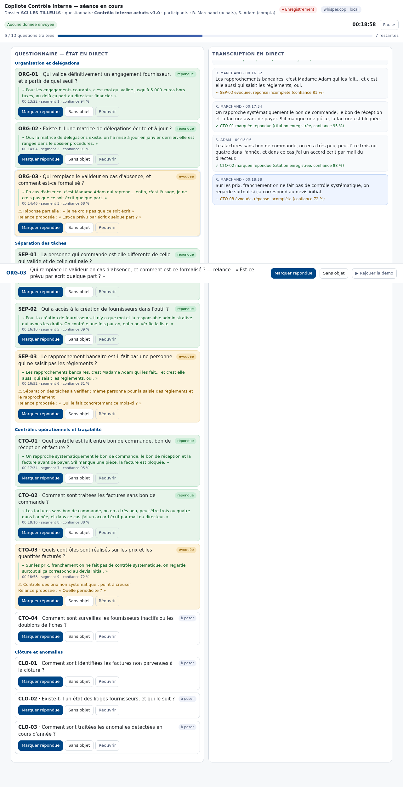

# Copilote Contrôle Interne

Application Android d'assistance **en direct** pour un collaborateur qui conduit une procédure de contrôle interne (entretien, revue de procédure, prise de connaissance).

Elle transforme un questionnaire en copilote de séance :

1. **transcrit la conversation au fil de l'eau** (reconnaissance vocale du système, français) ;
2. **repère les questions abordées** et les passe en « évoquée », avec la **citation horodatée** qui l'a déclenchée ;
3. **garde sous les yeux ce qui reste à poser**, section par section, avec la **relance à utiliser** quand un sujet n'a été qu'effleuré ;
4. **produit le compte rendu** de séance : questions traitées avec leurs citations, questions non traitées, sujets à creuser, actions à suivre, transcription complète — partageable en PDF et en markdown.

Public visé : collaborateurs juniors, pour qui le questionnaire est autant une **checklist de non-oubli** qu'un **guide de relance**.

## Aperçu de l'interface



Maquette de l'écran de séance (couleurs de la charte CNCC, bleu #004787 et terracotta #D66C54) :
à gauche le questionnaire avec l'état de chaque question et la citation entendue, à droite la
transcription en direct, en bas la question suggérée avec sa relance. Le fichier `docs/maquette.html`
est cliquable et rejoue une séance simulée.

## Principes

- **L'humain garde la main.** L'application propose (question évoquée), le collaborateur valide (« répondue », « sans objet »). Toute détection est réversible et tracée.
- **Tout reste sur l'appareil.** Audio, transcription et compte rendu sont écrits dans le stockage privé de l'application. Aucun serveur, aucun compte, aucune télémétrie.
- **Traçabilité.** Chaque question porte l'heure, la citation exacte, le niveau de confiance et l'origine (auto ou manuel).

## Écrans

- **Préparation** : dossier client, participants, choix du questionnaire.
- **Séance** : progression, question suggérée avec relance, deux onglets (questions / transcription), marquage en un tap, notes, actions, marqueur de fin de séance.
- **Revue** : questions non traitées, sujets à creuser, actions, génération du compte rendu (PDF + markdown) et partage.
- **Fin de séance** : l'application demande quoi faire de l'enregistrement audio — conserver ou effacer immédiatement.

## Questionnaires embarqués

Les trames sont des fichiers YAML du dossier [`questionnaires/`](questionnaires), converties en JSON embarqué par `tools/export_trames.py`.

| Trame | Questions | Sections |
|---|---|---|
| Cycle achats | 52 | 10 |
| Cycle paie et personnel | 51 | 10 |
| Cycle trésorerie | 50 | 10 |
| Prise de connaissance — entité et contrôle interne | 20 | 4 |

Chaque question porte : la formulation à l'oral, la **réponse attendue** (ce qui prouve que la réponse est complète), une **relance**, les **mots-clés** utilisés pour la détection automatique, et les pièces justificatives à demander.

La trame de prise de connaissance suit la démarche de la **NEP-315** (prise de connaissance de l'entité et de son environnement, identification et évaluation des risques) et les thèmes des outils CNCC correspondants. Aucun document CNCC n'est reproduit ici : les trames sont des questionnaires de travail rédigés pour l'application.

## Qualité des données

```bash
python3 docs/verifier_trames.py      # structure, identifiants, mots-clés, doublons, longueur des questions
python3 tools/export_trames.py       # YAML → assets JSON de l'application
```

## Compilation

```bash
export ANDROID_HOME=/chemin/vers/android-sdk
./gradlew assembleDebug     # APK de test
./gradlew assembleRelease   # APK signé (clé lue dans ~/.secrets/keystores-android/)
```

L'APK de production est publié dans les [releases](../../releases).

## Feuille de route

- **v1.1** : moteur de transcription locale whisper.cpp (comme `transcripto-stream`) en remplacement du moteur système, pour un fonctionnement entièrement hors ligne.
- **v1.2** : deuxième niveau d'appariement (embeddings locaux) pour détecter une réponse formulée sans les mots-clés de la trame, et arbitrage par un modèle local.
- **v1.3** : trames ventes, stocks et immobilisations ; reprise d'une séance interrompue ; historique des séances par dossier.
- **v2** : distribution des trames depuis le cabinet, sans republier l'application.

## Licence

Code sous licence MIT (voir `LICENSE`). Les trames de questionnaires sont des documents de travail du cabinet, libres d'adaptation.
